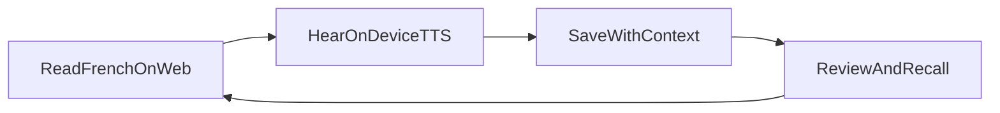
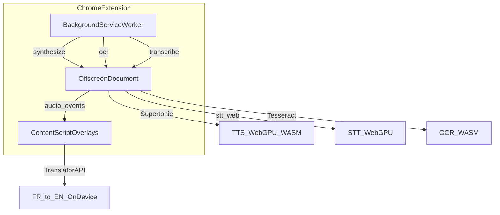

# Motif — Product PR

**Tagline:** *Hear it, save it, remember it.*

**One-liner:** A Chrome extension for French learners — on-device pronunciation, live tab transcription, and vocabulary capture while reading the real web.

**Audience:** English speakers learning French who consume news, YouTube, podcasts, and social content in the browser.

**Platform:** Chrome 113+ (WebGPU recommended). Chrome 138+ for built-in translation glosses. Extension only — no standalone app.

---

**Related docs**

- [PRODUCT.md](PRODUCT.md) — brand personality and design principles
- [DESIGN.md](DESIGN.md) — visual system for site and UI build
- [README.md](README.md) — install, development, and architecture

---

## 1. Elevator pitch

Motif is a Chrome extension that makes French on the open web legible and memorable. Select text on any page and hear natural pronunciation synthesized entirely on your device. Capture words with the sentence they came from. Review your vocabulary in a personal library with flashcards. Transcribe French audio from the tab you're watching — all without leaving the page or sending your reading habits to a cloud API.

Motif is built for learners who already read French where it lives: RFI, Le Monde, YouTube, Instagram, podcasts. It meets you in the tab you're already in.

**Brand voice:** Quietly confident, warm, editorial — closer to a well-designed reading tool than a gamified language app. Warm, precise, unobtrusive.

---

## 2. The problem and product thesis

French learners spend most of their study time on the open web, not inside a dedicated app. They hit friction at small moments: an unfamiliar word, a phrase they want to hear aloud, a podcast line they missed, text trapped in an image. The usual fixes break flow — copy-paste into a translator, open a separate flashcard app, rely on cloud TTS that sends text elsewhere, or switch tabs entirely.

Motif removes that friction by embedding learning tools directly into the reading surface. Keyboard shortcuts trigger on-device speech synthesis, OCR, and live transcription. Compact overlays appear near your selection, show word-level highlights during playback, and let you save vocabulary with real page context in a single gesture. Your personal library grows from what you actually read and watch.

The product thesis is a simple ladder:

**Hear it** — pronunciation and comprehension help in context.
**Save it** — vocabulary tied to the sentences and pages where you found it.
**Remember it** — review and active recall built on those saved entries (passive flashcards today; dictation and spaced repetition on the roadmap).

Success looks like a learner who stays in flow on the original page — hearing correct pronunciation, saving a word in one gesture, and returning to reading without context-switching to another app.

---

## 3. Feature showcase

Each feature includes a status badge, user benefit, how it works, and a **copy block** ready for a future landing page.

---

### Speak selection

**Status:** Shipped

Select French text on any webpage and press **Option+S** (Alt+S on Windows/Linux; configurable in Options). Motif synthesizes natural speech on-device and plays it in a floating overlay positioned near your selection. Partial words at selection edges expand to whole-word boundaries automatically (up to ~300 characters).

**How it works:** The background service worker receives the shortcut, sends text to an offscreen document running Supertonic TTS via ONNX Runtime Web, and streams audio back to a shadow-DOM overlay on the page.

> **Copy block**
>
> **Hear any French text on the web**
>
> Select a phrase and press a shortcut. Motif speaks it aloud with on-device synthesis — no copy-paste, no cloud API, no leaving the page.

---

### OCR capture mode

**Status:** Shipped

With no text selected, **Option+S** enters screen capture mode. The page dims; drag a rectangle over text — including text in images — and Motif runs French OCR, then speaks the recognized text in the same overlay flow as a normal selection.

**How it works:** A region screenshot is sent to Tesseract.js (French `fra` model) in the offscreen document. Recognized text flows into the standard TTS pipeline.

> **Copy block**
>
> **Text in an image? Capture and hear it.**
>
> Draw a box over any region of the page. Motif reads the French text on-device and speaks it back to you.

---

### Word-level highlight sync

**Status:** Shipped

During TTS playback, words highlight in sync with the audio. The overlay follows along word by word so you can connect sound to spelling.

**How it works:** Supertonic produces word alignment timings. An adaptive playback clock drives highlight updates at ~60 fps. See [docs/highlight-sync.md](docs/highlight-sync.md) for technical detail.

> **Copy block**
>
> **Follow along, word by word**
>
> As Motif speaks, each word lights up in time with the audio — so you connect pronunciation to the text you're reading.

---

### English glosses

**Status:** Shipped

Quick French-to-English translations appear in TTS and transcript overlays — for a full passage and for individual tapped words. Translations power the vocabulary save flow.

**How it works:** Chrome's built-in [Translator API](https://developer.chrome.com/docs/ai/translator-api) (FR→EN) runs on-device when available (Chrome 138+ desktop). No Motif server involved.

> **Copy block**
>
> **Instant English glosses**
>
> Tap a word or read a passage with optional English translation — powered by Chrome's on-device translation, not a third-party API.

---

### Live tab transcription

**Status:** Shipped

Press **Option+T** (Alt+T) on a tab playing French audio — YouTube, podcasts, radio — and Motif captures tab audio and shows a live transcript overlay. Pause, edit, reset, and replay. Toggle real-time translation while streaming or when paused.

**How it works:** `tabCapture` streams audio to an offscreen worker running [stt-web](https://idle-intelligence.github.io/stt-web/web/) (Kyutai STT 1B EN/FR, Q4 WebGPU). Transcripts stream to a shadow-DOM overlay. Edit mode uses a keyboard guard so media shortcuts don't fire while you type.

> **Copy block**
>
> **Transcribe what you're listening to**
>
> Press a shortcut on any tab with French audio. Motif transcribes live on your device — pause, edit, and tap any word to hear or save it.

---

### Interactive word pronunciation

**Status:** Shipped

Every French text surface in Motif is interactive. Tap or click any word to hear just that word or phrase re-synthesized. The same interaction works in TTS overlays, transcript overlays, the Saved Library, and entry detail dialogs.

**How it works:** `InteractiveWordText` tokenizes French text into tappable words. Tapping triggers on-demand Supertonic synthesis with loading shimmer and active-word highlight during playback.

> **Copy block**
>
> **Tap any word to hear it**
>
> Every French surface in Motif is tappable — hear a single word or phrase on demand, wherever you encounter it.

---

### Vocabulary capture

**Status:** Shipped

From any overlay, save a word or phrase with its English translation plus page context: the surrounding sentence, URL, and page title. Open a draggable **Saved** panel to add notes or attach additional contexts from other pages.

**How it works:** Vocabulary is stored locally in `chrome.storage.local`. Each entry keeps `original`, `translation`, `note`, and an array of `contexts` (sentence + source metadata). Import and export are supported via background messages.

> **Copy block**
>
> **Save words with real context**
>
> One tap saves a word with the sentence it came from — not an isolated flashcard entry, but vocabulary rooted in what you actually read.

---

### Saved Library

**Status:** Shipped

A full extension page to browse everything you've saved. Search, sort by date or context count, and paginate through a masonry grid. Open any entry for full detail: interactive French text, translation, source contexts with term highlighting, editable notes, WordReference link, and delete.

**How it works:** React + shadcn/ui extension page at `library.html`. Data from local vocab store; deep-link to a specific entry via URL param.

> **Copy block**
>
> **Your personal French vocabulary**
>
> Browse, search, and revisit every word you've saved — with the sentences and pages where you found them.

---

### Cards carousel

**Status:** Shipped

Switch the library to **Cards** mode for passive review. A week-scoped carousel shows flippable flashcards (French front, English back) with ghost adjacent cards and arrow-key navigation. Tap words on the active card to hear pronunciation. Open full entry details from any card.

**How it works:** Week rail ("This week", "Last week", …) scopes entries by save date. Carousel built on `SavedCardsCarousel` + `Flashcard` components. Layout preference persisted in local storage.

> **Copy block**
>
> **Review with weekly flashcards**
>
> Flip through the words you saved this week — a calm, focused review mode without gamification or streaks.

---

### Type-after-dictation

**Status:** Planned

Inside the saved entry dialog, hear a word or phrase via TTS, then type it from memory. Binary correct/incorrect feedback. Practice stats collected for future weak-spot sorting.

**How it works (planned):** Per-entry dictation mode in `SavedEntryDialog`, reusing existing Supertonic TTS. Spec: [docs/plans/library-study/library-study-v1.md](docs/plans/library-study/library-study-v1.md).

> **Copy block**
>
> **Active recall, one word at a time**
>
> Hear a saved word, type what you heard, and know instantly if you got it right — built on the vocabulary you already collected from the web.

---

### Spaced repetition and Practice hub

**Status:** Planned

A top-level Practice surface with pooled review sessions, multiple exercise types, and stats-driven sorting (e.g., words you miss most). Spaced repetition scheduling built on the same vocab schema.

**How it works (planned):** Extends library study spec and README roadmap. Same `InteractiveWordText`, same Supertonic TTS, same saved entries — not a separate app.

> **Copy block**
>
> **Remember what you saved**
>
> Spaced repetition and practice sessions built on your real vocabulary — words you encountered while reading and watching French on the web.

---

### IPA pronunciation

**Status:** Deferred

On-device IPA (International Phonetic Alphabet) display for saved words. Explored via ByT5 G2P ONNX; deferred due to integration complexity.

**Reference:** [docs/ipa-g2p-notes.md](docs/ipa-g2p-notes.md)

---

## 4. Distinct UX

What makes Motif different from Duolingo, Google Translate TTS, Readlang, or generic browser extensions.

### 4.1 Keyboard-first, in-context learning

Motif has no popup toolbar. The primary interface is keyboard shortcuts:

| Shortcut | Action |
|----------|--------|
| **Option+S** (Alt+S) | Speak selection or enter OCR capture mode |
| **Option+T** (Alt+T) | Start live tab transcription |

Shortcuts are configurable in Motif Options. Overlays appear near the text selection — not as full-page modals blocking the content you're reading.

**Screenshot placeholder:** TTS overlay anchored near a text selection on a French news article, with Listen/Stop controls visible.

---

### 4.2 Stay in the reading flow

Overlays live in isolated shadow DOM (~320–360px wide). They are compact, draggable, and dismiss on outside click. The web page remains the primary surface.

Loading states use plain language and progressive disclosure:
1. "Loading model…" (first run or cold start)
2. "Generating pronunciation…" (synthesis in progress)
3. Playback with word highlights

Errors explain what happened (model download failed, tab capture denied, worker unavailable) without jargon.

**Screenshot placeholder:** Overlay in "Generating pronunciation…" state on a dimmed page, showing the compact panel size relative to the article.

---

### 4.3 InteractiveWordText — one interaction everywhere

French text is tokenized into clickable words across every surface: TTS overlay, transcript overlay, library cards, entry dialog, context sentences.

Visual states:
- **Loading shimmer** while a word is synthesizing
- **Active highlight** during word playback
- **Gray fill** on non-active words in a selected multi-word phrase
- **Saved-term highlight** in context sentences

Tap a word → hear it → see English gloss → save to vocab or open existing entry. One row, one gesture.

**Screenshot placeholder:** Word overlay showing Original + Translation row with save (+) and open (→) actions.

---

### 4.4 Context-rich vocabulary capture

Motif saves more than a word and its translation. Each entry stores:
- The **original** French text
- An **English translation**
- One or more **contexts**: the surrounding sentence, page URL, and page title
- A freeform **note**

When you revisit an entry, contexts show the term highlighted in the sentence where you found it. Notes auto-save with debounced persistence. A WordReference link opens for deeper lookup.

This is vocabulary rooted in real usage — not isolated pairs disconnected from where you learned them.

**Screenshot placeholder:** Saved entry dialog with multiple contexts, term highlighted in each sentence, and an editable note field.

---

### 4.5 Dual study modes in the Library

**List mode:** Masonry grid with search, sort (by date or context count), and paginated load-more. Best for finding and browsing.

**Cards mode:** Week-scoped carousel with flippable FR/EN flashcards, ghost adjacent cards, and keyboard navigation. Best for passive review.

Both modes support word-level TTS on the active entry. Layout preference persists across sessions.

**Screenshot placeholder:** Cards mode with week rail ("This week"), center active card, and ghost cards on either side.

---

### 4.6 Privacy-first on-device stack

After first-run downloads (~1 GB total across TTS and STT models), inference runs entirely on your device:
- No cloud LLM calls
- No server-side reading analytics
- Vocabulary stored in local extension storage
- OCR runs in-browser via Tesseract WASM

Translation uses Chrome's on-device Translator API when available — Chrome manages its own language packs.

Motif respects the reading habit: what you read stays on your machine.

---

### 4.7 Design language

Motif's visual identity draws from a warm editorial canvas, not gamified language-app chrome:

| Token | Value | Use |
|-------|-------|-----|
| Canvas | `#f7f7f4` | Page background |
| Ink | `#26251e` | Headings and strong body |
| Primary | `#f54e00` | CTAs, accent, wordmark |
| Hairline | `#e6e5e0` | Card borders |

Cards use hairline borders, no drop shadows, generous spacing. Extension pages (Options, Library) use React + shadcn/ui + Tailwind. Overlays use legacy CSS in shadow DOM (shadcn migration planned).

**Anti-references** (what Motif is not):
- Dark IDE / developer-dashboard shells
- Streak flames, XP badges, loud gradients
- Generic AI-marketing pages with identical card grids and gradient text
- Floating panels that feel like ads
- Cloud-dependent TTS that breaks offline or leaks reading habits

Full spec: [DESIGN.md](DESIGN.md)

---

## 5. On-device model stack

Motif runs heavy ML workloads in a Chrome offscreen document. Content scripts render overlays; the background service worker orchestrates sessions.

### Model credits

| Capability | Technology | Link | Motif usage |
|------------|------------|------|-------------|
| **Text-to-speech** | Supertonic 3 (ONNX) | [github.com/supertone-inc/supertonic](https://github.com/supertone-inc/supertonic/) | Selection, OCR, and library word pronunciation. Custom web port via `onnxruntime-web` — not an npm package. Model: `Supertone/supertonic-3` on Hugging Face (~400 MB). 10 voices (F1–F5, M1–M5). WebGPU preferred, WASM fallback. |
| **Speech-to-text** | stt-web (Kyutai STT 1B EN/FR) | [idle-intelligence.github.io/stt-web/web](https://idle-intelligence.github.io/stt-web/web/) | Live tab audio transcription. Runtime vendored from GitHub (no npm package). Model: `idle-intelligence/stt-1b-en_fr-q4_0-webgpu` (~640 MB, Q4 WebGPU). |
| **OCR** | Tesseract.js v7 | [github.com/tesseract-ocr/tesseract](https://github.com/tesseract-ocr/tesseract) | French text recognition from screen capture regions. `tesseract.js@7.0.0` with `fra.traineddata.gz` bundled at build. Fully on-device WASM. |
| **Translation** | Chrome Translator API | [developer.chrome.com/docs/ai/translator-api](https://developer.chrome.com/docs/ai/translator-api) | FR→EN glosses in overlays and vocab save. Browser built-in; no npm dependency. Requires Chrome 138+ desktop. |

### Execution and caching

- **TTS inference:** WebGPU first; on failure, all ONNX sessions retry with WASM only.
- **Model download:** First run fetches from Hugging Face (or local dev server during development). Cached in browser Cache API (`mot-supertonic-v3`, `mot-stt-model-v1`).
- **Voice selection:** User picks from 10 Supertonic voices in Options (default F1 — calm, composed).
- **Language mode:** `French` or `Language-agnostic` for TTS synthesis.
- **No cloud LLMs:** No Gemini, OpenAI, or other server-side inference in the shipped product.

### Privacy

> **On your device, after first download**
>
> Motif downloads model weights once (~400 MB TTS, ~640 MB STT, plus bundled OCR assets). All synthesis, transcription, and OCR run locally. Vocabulary lives in `chrome.storage.local`. Motif does not send your reading text to a server for processing.
>
> Translation uses Chrome's on-device AI when available — managed by Chrome, not Motif.

**Future:** Authenticated model CDN with Google sign-in for private TTS model delivery — inference remains on-device. See [docs/authenticated-model-cdn.md](docs/authenticated-model-cdn.md).

---

## 6. User journeys

Ready-to-lift walkthroughs for a future "How it works" section.

### Journey 1: Read and hear

1. Open a French article, post, or any webpage with French text.
2. Select a phrase you want to hear.
3. Press **Option+S**.
4. Motif shows a compact overlay near your selection. On first use, models download; then speech generates and plays.
5. Words highlight in sync as you listen.
6. Tap any word to hear it alone or see its English gloss.
7. Tap **+** to save the word with the surrounding sentence and page context.
8. Dismiss the overlay and keep reading.

### Journey 2: Image and OCR

1. Find French text in an image or non-selectable region.
2. Press **Option+S** without a text selection.
3. The page dims. Drag a rectangle over the text.
4. Motif captures the region, runs French OCR, and speaks the result.
5. Continue with highlights, word taps, and vocab save as in Journey 1.

### Journey 3: Listen and transcribe

1. Open a tab playing French audio (YouTube, podcast, radio).
2. Press **Option+T**. Allow tab audio capture when prompted.
3. A live transcript overlay appears as speech is recognized.
4. Pause to read, edit the transcript, or toggle English translation.
5. Tap any word to hear pronunciation or save it to your vocabulary.
6. Press stop when done. Transcription is single-tab; closing the tab ends the session.

### Journey 4: Review and remember

1. Open **Motif → Saved Library** from Options or the extension menu.
2. Browse in **List** mode: search, sort, open entries for full detail.
3. Or switch to **Cards** mode: navigate by week, flip FR/EN flashcards, hear words on the active card.
4. Open an entry for contexts, notes, and WordReference lookup.
5. *(Planned)* Enter dictation mode: hear a word, type it, get instant feedback.

---

## 7. Roadmap and vision

Motif's arc is **Hear → Save → Remember**. Each stage builds on the last using the same vocab schema, the same interactive text surfaces, and the same on-device models.

### Now (v1.0)

- On-device TTS with word-level highlight sync
- OCR capture for image and non-selectable text
- Live tab transcription with pause, edit, and translation
- Interactive word pronunciation everywhere
- Vocabulary capture with page context
- Saved Library with list and cards modes
- Configurable shortcuts, voice, and language mode

### Next

- **Type-after-dictation** per saved entry — active recall without leaving the library
- Practice stats collection (`attemptCount`, `mistakeCount`) for future sorting

Spec: [docs/plans/library-study/library-study-v1.md](docs/plans/library-study/library-study-v1.md)

### Later

- **Practice hub** — pooled review sessions across saved vocabulary
- **Spaced repetition** scheduling
- Stats-driven weak-spot sorting and familiarity flags
- EN ↔ FR translation exercises
- Bookmarks and curated word pools

### Explored / deferred

- On-device IPA via G2P models — [docs/ipa-g2p-notes.md](docs/ipa-g2p-notes.md)
- Authenticated model CDN — [docs/authenticated-model-cdn.md](docs/authenticated-model-cdn.md)

Roadmap items extend existing UX patterns — they are not a pivot to a different product shape.

---

## 8. Website copy appendix

Lift-ready blocks for a future landing page. No internal references.

### Hero

**Headline:** Hear French on the web. Save what you learn. Remember it.

**Subhead:** Motif is a Chrome extension that pronounces, transcribes, and captures French vocabulary — entirely on your device, right in the page you're reading.

**CTA:** Add to Chrome *(placeholder)*

### Value props

1. **Stay in flow.** Hear pronunciation and save words without leaving the tab you're reading.
2. **On your device.** Speech, transcription, and OCR run locally after a one-time download — your reading stays private.
3. **Context, not cards.** Every saved word comes with the sentence and page where you found it.

### Feature grid

**Speak any selection**
Select French text and press a shortcut. Motif speaks it with natural on-device synthesis and highlights each word as it plays.

**Capture text in images**
Draw a box over text in photos or graphics. Motif reads the French on-device and speaks it back.

**Transcribe live audio**
Transcribe French from the tab you're watching — YouTube, podcasts, radio. Pause, edit, and tap any word to hear or save it.

**Tap to hear, tap to save**
Every French surface is interactive. Hear a word, see its English gloss, and save it with one gesture.

**Your personal library**
Browse, search, and revisit everything you've saved — with the sentences and sources where you found each word.

**Weekly flashcards**
Review with a calm carousel of flippable cards scoped by week. No streaks, no XP — just the words you collected from real reading.

### Why on-device

Language learning happens in private moments — an article before bed, a podcast on the commute, a social post between meetings. Motif keeps those moments on your machine. After a one-time model download, speech synthesis, transcription, and OCR run locally. Your vocabulary is stored in your browser, not on our servers. We don't process your reading text in the cloud because we don't need to.

### Model credits (footer)

Motif is built on open and browser-native technologies:

- [Supertonic](https://github.com/supertone-inc/supertonic/) — text-to-speech
- [stt-web](https://idle-intelligence.github.io/stt-web/web/) — speech-to-text
- [Tesseract](https://github.com/tesseract-ocr/tesseract) — optical character recognition
- [Chrome Translator API](https://developer.chrome.com/docs/ai/translator-api) — on-device translation

### FAQ

**What browser do I need?**
Chrome 113 or later. WebGPU is recommended for best performance. English glosses require Chrome 138+ on desktop.

**How much storage do models use?**
About 400 MB for speech synthesis and 640 MB for transcription, downloaded once and cached in your browser.

**Does Motif work offline?**
After models are downloaded, TTS, STT, and OCR work offline. Translation depends on Chrome's on-device language packs. Initial model download requires network access.

**Is my reading data sent to a server?**
No. Synthesis, transcription, and OCR run on your device. Vocabulary is stored locally in extension storage.

**What languages are supported?**
Motif is built for French learners. TTS supports French and language-agnostic modes. STT handles English and French. OCR is French-only. Translation is FR→EN.

**Is Motif free?**
*(Placeholder — pricing TBD)*

### Meta description

Hear it, save it, remember it. On-device French pronunciation and live tab transcription for Chrome. Select text, capture images, transcribe audio, and build your vocabulary — without leaving the page.

*(155 characters for search snippets)*

---

*Last updated: June 2025. For development setup and architecture, see [README.md](README.md).*
